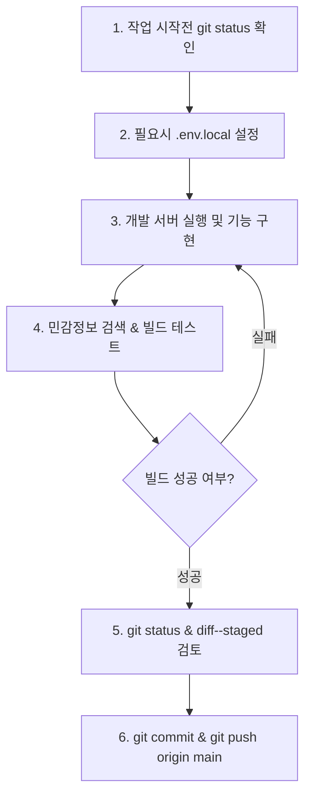

# 🚨 Codex 작업 인계 및 DM 가이드 문서 (CODEX_HANDOVER_GUIDE.md)

> **문서 목적**: 본 문서는 Codex AI 및 다음 개발자가 본 저장소(`itakura-git`)에서 안심하고 개발, 마이그레이션, 유지보수 작업을 수행할 수 있도록 작성된 **통합 작업 인계 및 핵심 주의사항 지침서(DM Guide)**입니다.

---

## ⚠️ 1. 가장 중요한 주의사항 & 절대 금지 수칙 (CRITICAL WARNINGS)

이 프로젝트에서 작업할 때는 다음 규칙을 **반드시 엄수**해야 합니다.

### 🔴 절대 금지 사항 (Strict Prohibition)
1. **원본 저장소 수정/삭제 금지**: `C:\Users\Asus\Documents\Codex\2026-08-01\rlt\work\local-site\itakura-main` 폴더는 원본 취급하며, 수정이나 삭제를 절대 진행하지 마십시오.
2. **`.git` 폴더 삭제/덮어쓰기 금지**: `itakura-git` 내의 `.git` 히스토리 폴더를 삭제하거나 덮어쓰지 마십시오.
3. **민감정보 GitHub 유출 절대 금지**:
   * 비밀번호, API Key, GitHub Token, Supabase `SUPABASE_SERVICE_ROLE_KEY`, JWT, 개인키(`*.pem`, `*.key`, `*.p12`)는 **절대 커밋 및 push하지 마십시오**.
   * `.env`, `.env.local`, `.env.development.local` 등의 파일은 `.gitignore`에 등록되어 있어야 하며, 실수로 `git add` 되지 않도록 항상 `git status`로 재검증하십시오.
4. **파괴적인 Git 명령어 사용 금지**:
   * `git push --force` (`-f`), `git reset --hard` (기존 이력 삭제)는 사용을 금지합니다.
   * 원격 `main`과 충돌이 발생하면 강제로 덮어쓰지 말고 차이점을 비교 분석하여 보고하십시오.
5. **검증 없는 Push 금지**: `pnpm run build` (`next build`)를 통한 컴파일 및 Static Prerender 성공을 확인하기 전에는 절대로 push하지 마십시오.

---

## 💡 2. 주요 작업 포인트 & 핵심 기술 노하우 (IMPORTANT POINTS)

### 1) 환경변수 & Supabase Client 설정
* **빌드 호환성 (Fallback 설정 완료)**: `lib/supabase/client.ts`에는 빌드 타임에 `.env.local`이 없어도 `next build`가 정상 완료되도록 기본 Fallback URL/Key가 적용되어 있습니다.
* **실제 연동 시**: 로컬 개발이나 실제 DB 연동 시에는 반드시 루트 디렉토리에 `.env.local`을 작성하고 실제 값으로 설정하십시오.
  ```env
  NEXT_PUBLIC_SUPABASE_URL=https://your-supabase-ref.supabase.co
  NEXT_PUBLIC_SUPABASE_PUBLISHABLE_KEY=your-publishable-anon-key
  ```
* **Service Role Key 보안**: `SUPABASE_SERVICE_ROLE_KEY`는 RLS(Row Level Security)를 우회하므로 클라이언트 코드(`NEXT_PUBLIC_*`) 및 브라우저에 절대로 포함시키면 안 됩니다.

### 2) 런타임 및 개발 명령 (Windows Codex 환경)
Codex CLI/Powershell 환경에서 Node.js/pnpm 기본 명령어가 PATH에 잡히지 않을 경우 아래의 직렬화 경로를 사용합니다:

* **Node.js 실행 파일**: `C:\Users\Asus\.cache\codex-runtimes\codex-primary-runtime\dependencies\node\bin\node.exe`
* **pnpm CLI 스크립트**: `C:\Users\Asus\.cache\codex-runtimes\codex-primary-runtime\dependencies\node\node_modules\pnpm\bin\pnpm.cjs`

#### 추천 명령어 예시:
* **개발 서버 (3000 포트)**:
  ```bash
  node node_modules/next/dist/bin/next dev -p 3000
  ```
* **프로덕션 빌드 & 검증**:
  ```bash
  node node_modules/next/dist/bin/next build
  ```

---

## 📁 3. 저장소 및 데이터 구조

* **로컬 작업 저장소**: `C:\Users\Asus\Documents\Codex\2026-08-01\rlt\work\local-site\itakura-git`
* **원격 GitHub 저장소**: `https://github.com/ldavit125-spec/itakura.git` (`main` 브랜치)

### 핵심 디렉토리 및 역할
```
itakura-git/
├── app/                        # Next.js App Router (페이지 및 레이아웃)
│   ├── (app)/                  # 메인 대시보드 및 모듈별 페이지
│   │   ├── admin/              # 관리자 및 계정 권한 (/admin)
│   │   ├── master-data/        # 기준 정보 관리 (/master-data)
│   │   ├── materials/          # 자재/원료 관리 (/materials)
│   │   ├── production/         # 생산 관리 (/production)
│   │   ├── quality/            # 품질 관리 (/quality)
│   │   ├── shipments/          # 출하 관리 (/shipments)
│   │   └── traceability/       # 이력 추적 (/traceability)
├── components/                 # UI 컴포넌트 & 모달 (기능별 분리)
├── context/                    # React Context (전역 상태 및 DB 데이터 상태 연동)
├── lib/                        # 비즈니스 수식 및 Supabase Client/Queries
│   └── supabase/               # Supabase CRUD 쿼리 함수 모듈
├── supabase/                   # Supabase SQL 스키마 및 데모 데이터
│   ├── migrations/             # 202608010001_initial_schema.sql, 202608010003_demo_rls_policies.sql
│   └── seed.sql                # 초기 데모 데이터셋
└── CODEX_HANDOVER_GUIDE.md     # 본 인계 지침 문서
```

---

## 🔄 4. 표준 작업 프로세스 (Codex Standard Workflow)

Codex에서 작업을 시작하고 마무리할 때는 다음 순서로 진행하십시오.



1. **상태 확인**: `git status`로 이전 미커밋 내역이 없는지 확인합니다.
2. **개발 및 수정**: 기능 구현 시 `components/` 및 `context/`에 상태를 안전하게 바인딩합니다.
3. **민감정보 감사 (Audit)**: `password`, `token`, `secret`, `api_key` 등의 실제 비밀값이 소스에 포함되지 않았는지 점검합니다.
4. **빌드 검증**: `node node_modules/next/dist/bin/next build` 명령을 실행하여 Static Prerendering 14개 라우트가 모두 성공하는지 확인합니다.
5. **Stage & Commit**: `git add .` 후 `git status`를 확인하고 의미 있는 커밋 메시지로 커밋합니다 (`git commit -m "feat: ..."`).
6. **Push**: `git push origin main`으로 일반 push를 수행하고 원격 커밋 해시를 확인합니다.

---

## ✅ 5. Codex 다음 작업자 체크리스트

- [ ] `itakura-main` 원본 디렉토리를 건드리지 않았는가?
- [ ] `.env.local` 등 민감정보 파일이 `git status`에 추적 대상으로 포함되지 않았는가?
- [ ] 소스 코드에 실제 API Key나 Service Role Key가 하드코딩되지 않았는가?
- [ ] `next build` 실행 시 모든 페이지가 Static / Dynamic으로 정상 빌드되는가?
- [ ] `git push origin main` 실행 후 원격 `main`에 성공적으로 반영되었는가?
